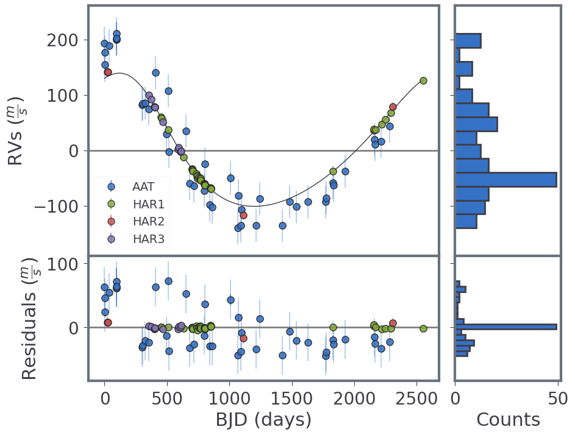
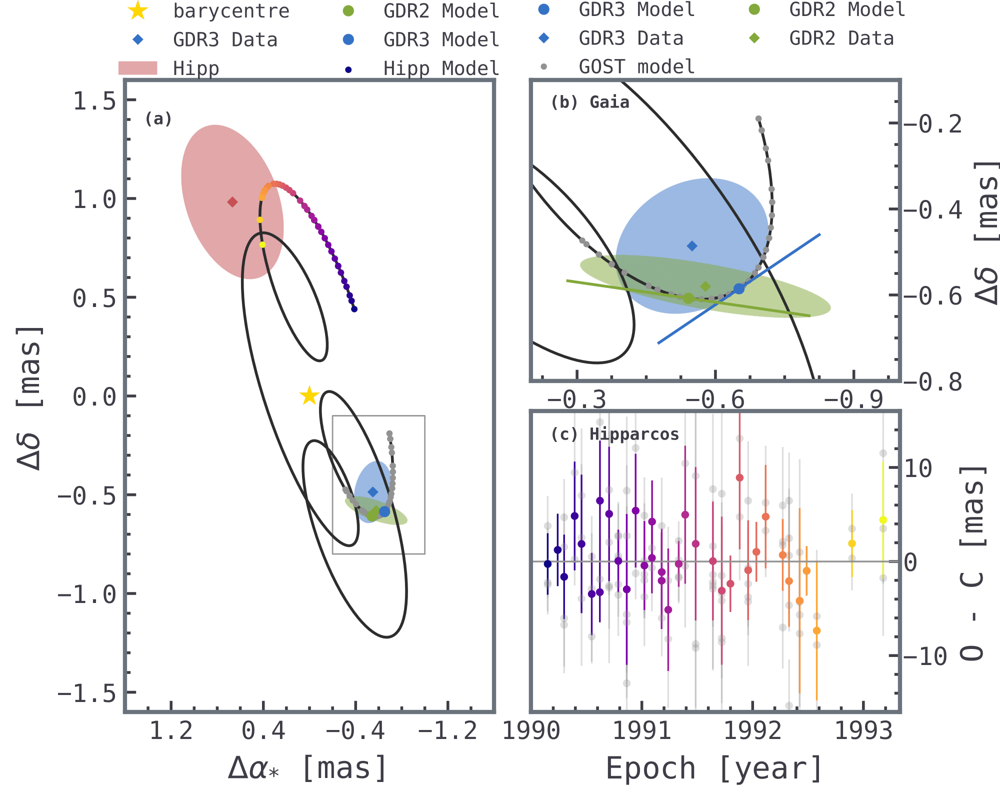

# Astrometry

This section is a hands-on tutorial on how to make a simple run with joint RVs with astrometry (RVAM).
We use the HIP 21850 data available on [GitHub](https://github.com/ReddTea/astroemperor/tree/main/tests/datafiles/HIP21850).

## Data
We need to set up our working directory with two subfolders, `datafiles` and `datalogs`. 

`datafiles` will contain both our RV and AM catalogues. For each target or system we create a subfolder with the system name. In this case, `HIP21850`. Inside, we create two subfolders, one named `RV`, which will contain the RV data, and another named `AM`, containing the astrometry data.

We copy-paste the file downloaded from GitHub into `/datafiles/HIP21850`.


```
📂working_directory
 ┣ 📜mini_test.py
 ┣ 📂datafiles
 ┃ ┣ 📂HIP21850
 ┃ ┃ ┗ 📂RV
 ┃ ┃ ┃ ┗ 📜HIP21850_1_AAT.vels
 ┃ ┃ ┃ ┣ 📜HIP21850_2_HARPS1.vels
 ┃ ┃ ┃ ┣ 📜HIP21850_3_HARPS2.vels
 ┃ ┃ ┃ ┗ 📜HIP21850_4_HARPS3.vels
 ┣ 📂datalogs
 ┃ ┣ 📂HIP21850
 ┃ ┃ ┗ 📂run_1
```

## Setting up EMPEROR

Under our working directory, we create a python file named `hip21850_test`.
First, we import the library and start our simulation:

```python
import astroemperor as emp
import numpy as np
import multiprocessing
np.random.seed(1234)


sim = emp.Simulation()
sim.cores__ = multiprocessing.cpu_count()
```

### Setting the engine

For this example, we will use `reddemcee`, with 11 temperatures, 256 walkers, 3000 sweeps each of 1 step:

```python
ntemps, nwalkers, nsweeps, nsteps = 11, 256, 3000, 1

sim.set_engine('reddemcee')
sim.engine_config['setup'] = [ntemps, nwalkers, nsweeps, nsteps]

# Custom adaptation options for reddemcee engine
sim.engine_config['tsw_history'] = True
sim.engine_config['smd_history'] = True
sim.engine_config['adapt_tau'] = 100
sim.engine_config['adapt_nu'] = 1.0
sim.engine_config['adapt_mode'] = 0

# Manual ladder
sim.engine_config['betas'] = list(np.geomspace(1, 0.001, ntemps))
# sim.engine_config['betas'][-1] = 0  # Optionally, for exact evidence estimation

sim.run_config['burnin'] = 0.5  # its in niter
```

### Setting the model
We feed the name of the instruments (optional), as well as the starmass and starmass error to calculate the true-mass and semi-major axis. We add some boundaries to speed up the process:

```python
sim.starmass = 	0.9800  # ±0.1150  # hip21850, feng 2022 https://exoplanetarchive.ipac.caltech.edu/overview/HD%2030177
sim.starmass_err = 0.1150
sim.instrument_names_RV = ['AAT', 'HAR1',
                           'HAR2', 'HAR3']

# Model options
sim.jitter_prargs = [0, 10]
sim.eccentricity_prargs = [0, 0.3]
sim.acceleration = 1  # linear trend


# Offsets and Jitters manual boundaries
for i in range(1, 5):
    sim.add_condition([f'Offset {i}', 'limits', [-100, 100]])
    sim.add_condition([f'Jitter {i}', 'limits', [1e-4, 30]])

# we constrain a bit the planetary parameters
sim.add_condition(['Period 1', 'limits', [2000, 3000]])
sim.add_condition(['Amplitude 1', 'limits', [1e-4, 200]])
sim.add_condition(['Eccentricity 1', 'limits', [0, 0.5]])
sim.add_condition(['Phase 1', 'limits', [np.pi, 2*np.pi]])
sim.add_condition(['Longitude 1', 'limits', [0, np.pi]])

# We also constrain astrometric offsets
for offset in ['RA', 'DE', 'PLX', 'pm RA', 'pm DE']:
    sim.add_condition([f'Offset {offset}', 'limits', [-1, 1]])  # usually -10, 10

# Finally, we set some sensible priors for Hipparcos and Gaia
sim.add_condition(['Jitter Gaia', 'limits', [0, 10]])  # fractional jitter
sim.add_condition(['Jitter Gaia', 'prior', 'Normal'])
sim.add_condition(['Jitter Gaia', 'prargs', [1, 0.1]])

sim.add_condition(['Jitter Hipparcos', 'limits', [0, 10]])  # additive jitter
sim.add_condition(['Jitter Hipparcos', 'prior', 'Normal'])
sim.add_condition(['Jitter Hipparcos', 'prargs', [0, 5]])
```

### Plotting Options
We add some plotting options to speed up this test a little. We will only plot the posteriors for the cold chain. Also, we won't use the `arviz` optional plots.

```python
sim.plot_posteriors['temps'] = [0]
sim.plot_gaussian_mixtures['plot'] = False
sim.plot_trace['plot'] = False
sim.plot_histograms['plot'] = False
```

Finally, we read the data and run our simulation (it will take a few minutes):

```python
sim.load_data('HIP21850')  # folder read from /datafiles/
sim.autorun(1, 1)
```

### And we see the results:


### Second signal
Can you find the second planet? Try setting `sim.acceleration=0`, and period 2 between 5000 and 15000 days!

Hint:



