# The Results

## Run Review

All results can be found in the `datalogs` folder:

```
📂working_directory
 ┣ 📂datalogs
 ┃ ┣ 📂51Peg
 ┃ ┃ ┗ 📂run_1
 ┃ ┃ ┃ ┗ 📂k_0
 ┃ ┃ ┃ ┗ 📂k_1
 ┃ ┃ ┃ ┃ ┗ 📂plots
 ┃ ┃ ┃ ┃ ┗ 📂restore
 ┃ ┃ ┃ ┃ ┗ 📂samples
 ┃ ┃ ┃ ┃ ┗ 📂tables
 ┃ ┃ ┃ ┃ ┗ 📂temp
 ┃ ┃ ┃ ┃ ┗ 📜best_fit.dat
 ┃ ┃ ┃ ┃ ┗ 📜log_1_51Peg.dat
```

- The log.dat file contains a summary of the whole run up to this point, plus everything that was printed on the terminal.
- The best_fit.dat has a summary of the best values.
- The `plots` folder contains all plots for this run.
- The `restore` folder contains the chain members compressed in `.h5` format as well as the residuals of the model. This folder must be targeted to continue a run from this point.
- The `samples` folder is deprecated.
- The `tables` folder contains information about the chains, the parameters and the stats, as well as copy-pastable latex tables.
- The `temp` folder contains all the temporary files made for the run.

## Tables

Output example of the latex table, `values.tex`:

```latex
\begin{tabular}{ll}
\toprule
Parameter & Value \\
\midrule
Period 1 & $4.23078861^{+8.2e-06}_{-2.089e-05}$ \\
Amplitude 1 & $55.60434115^{+0.26899442}_{-0.14248269}$ \\
Phase 1 & $1.61264175^{+0.47363979}_{-0.12433487}$ \\
Eccentricity 1 & $0.01221629^{+0.00042225}_{-0.00621666}$ \\
Longitude 1 & $1.11372836^{+0.1321468}_{-0.46498999}$ \\
Acceleration & $-0.00429192^{+0.00011135}_{-0.00028684}$ \\
Offset 1 & $5.21358051^{+0.23550286}_{-0.09804832}$ \\
Jitter 1 & $0.70021693^{+0.15318861}_{-0.45306398}$ \\
\bottomrule
\end{tabular}
```

Output example of `stats.tex`:

```latex
\begin{tabular}{ll}
\toprule
Stat & Value \\
\midrule
$\log{Z}$ & -902.413 +- 23.211 \\
$\log{P}$ & -859.835 \\
$\log{L}$ & -837.213 \\
BIC  & 1718.787 \\
$chi^{2}_{\nu}$ & 1.035 \\
RMSE & 6.906 \\
\bottomrule
\end{tabular}
```

the latex table paramter values can be rounded by setting before-hand:

```
sim.rounder_tables = 3
```

## Plots
Each plot is customisable through its own dictionary. Additionally, you can modify common options through the `plot_all` property. Every plot has the `plot` keyword, to turn on or off the plot, as well as a `format` keyword, default set to 'png'.
The plots can be found in the following folders:

 📂k_1
 ┣ 📂plots
 ┃ ┗ 📂arviz
 ┃ ┗ 📂betas
 ┃ ┗ 📂GMEstimates
 ┃ ┗ 📂histograms
 ┃ ┗ 📂models
 ┃ ┗ 📂posteriors

### Posterior Plot
Posteriors are plotted colour-coded by block, in four different formats.
To select which modes to plot, include them in the `modes` list.

| Mode              | Value (int)   | Description         |
|-------------------|---------------|---------------------|
| Scatter           | 0             | Simple scatter plot. Useful for checking the overall shape of the posterior distribution. |
| Hexbin            | 1             | Hexbin plot. Usefull for visualising the samples allocation.          |
| Gaussian filter   | 2             | Scatter plot with markers Gaussian-difussed. Serves both for overall posterior shape and sample density.      |
| Chain             | 3             | A chain plot to oversee the space exploration over time.           |

Each mode and plotting utility has its own dictionary as well, passed as kwargs to the default matplotlib plotting function. To modify any default values, do it through:

```python

sim.plot_posteriors['modes'] = [0, 3]  # Scatter and chain
sim.plot_posteriors['temps'] = None  # Plots all temperatures. [0, 8] plots for the cold chain and the 8th temp

sim.plot_posteriors['scatter_kwargs']['alpha'] = 0.7  # transparency
sim.plot_posteriors['scatter_kwargs']['s'] = 10  # marker size

sim.plot_posteriors['chain_kwargs']['alpha'] = 0.2  # transparency
sim.plot_posteriors['chain_kwargs']['marker'] = 'o'  # marker shape

sim.plot_posteriors['vlines_kwargs']['alpha'] = 0.75  # global
sim.plot_posteriors['label_kwargs']['fontsize'] = 44  # global
```

Examples:
Posterior plot (mode=0) for the Keplerian Block, cold chain (temp=0):
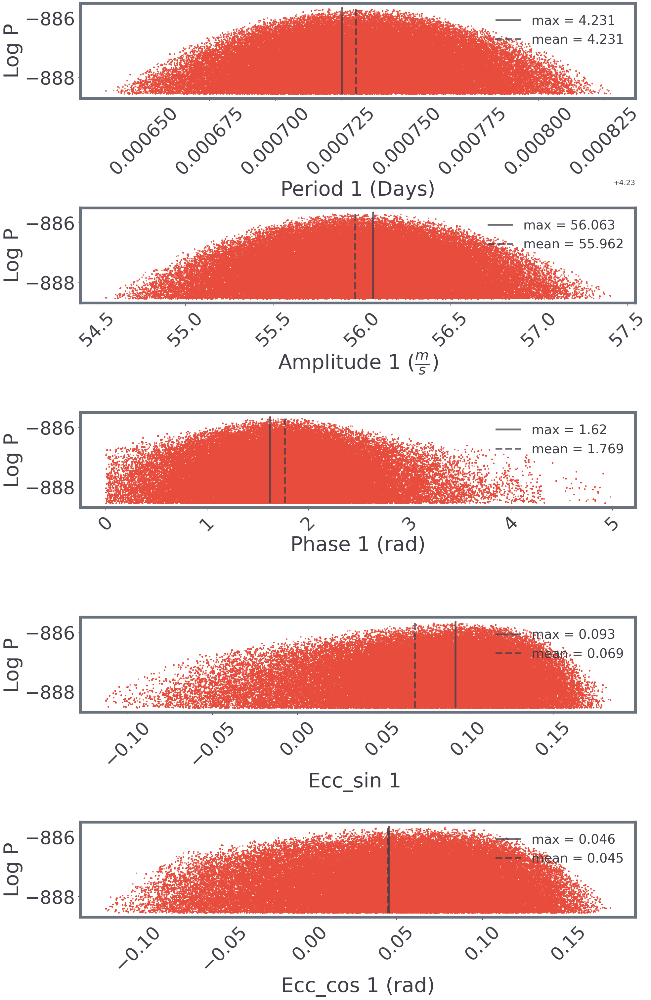

Posterior plot (mode=0) for the same Keplerian Block, at temp=8:
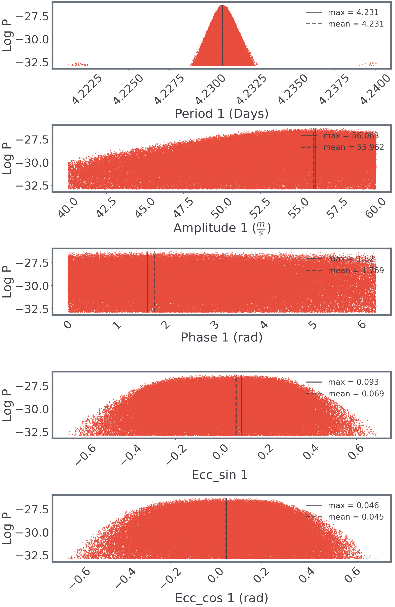

Offset Block, hexbin plot (mode=1):
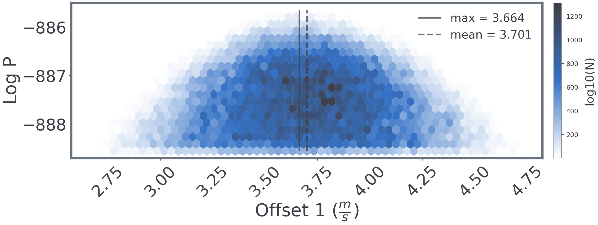

Offset Block, Gaussian plot (mode=2):
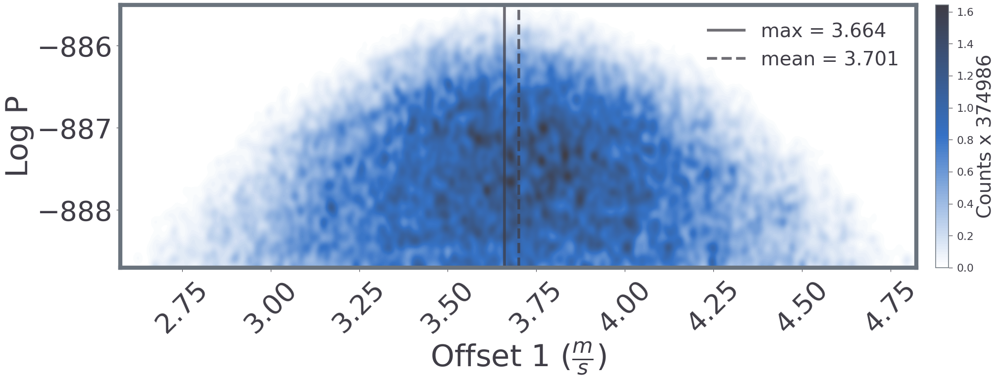


### Histograms

```python
sim.plot_histograms['temps'] = None  # Plots all temperatures. [0, 8] plots for the cold chain and the 8th temp

sim.plot_histograms['axis_fs'] = 18
sim.plot_histograms['title_fs'] = 24
```

Plot of the Histograms:


### Model
Model with its residuals. Histograms at the side showing the RV distribution.

```python
sim.plot_keplerian_model['hist'] = True  # Turn on/off the histograms

sim.plot_keplerian_model['errors'] = True  # add errorbars for measured error and jitter
sim.plot_keplerian_model['periodogram'] = True  # Plot a periodogram for the residuals
```

Plot of the Keplerian model:
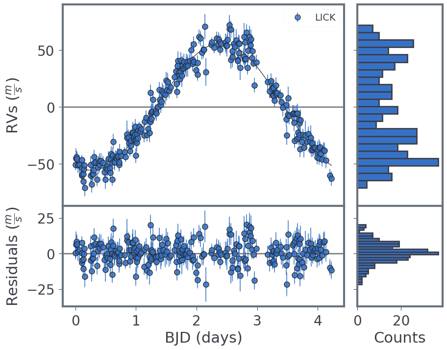

### Betas
Plots pertaining the `reddemcee` sampler.  

```python
sim.plot_betas['plot'] = True  # Turn on these plots
sim.plot_betas['format'] = 'png'  # save as png
```

The `ladder` plot shows the final inverse temperature distribution, against the mean log-likelihood of each chain. Both values are used to estimate the \\(\log Z\\) with thermodynamic integration:
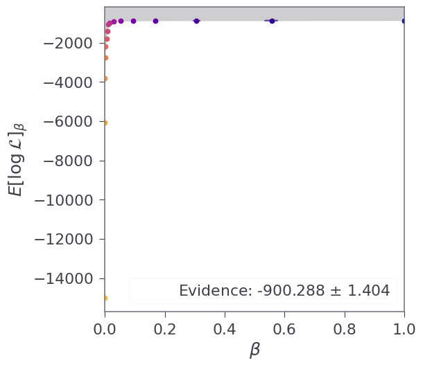


The `rate` plot helps to assess the adaptation of the temperatures. From top to bottom, temperature evolution over time, temperature swap rate, and Swap Mean Distance:
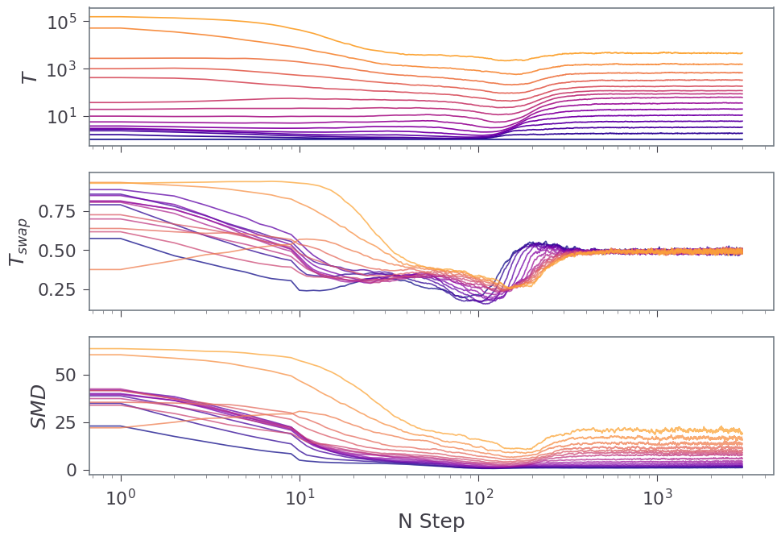

The `density` plot tracks how close to each other the temperatures are. This is the chain density across temperatures. Peaks signal where phase-change occurs within this MCMC system, or where different solutions merge:

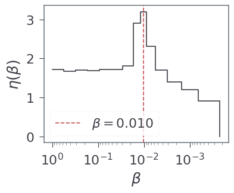


### Trace Plots

The traceplots are additional plots that require the `arviz` library installed. Four modes are considered:

| Mode                  | Value (int) |
|-----------------------|-------------|
| Trace                 | 0           | 
| Normalised Posterior  | 1           | 
| Density Interval      | 2           |
| Corner                | 3           |


```python
sim.plot_trace['modes'] = [0, 1, 2, 3]
```

Trace for the Keplerian parameters:
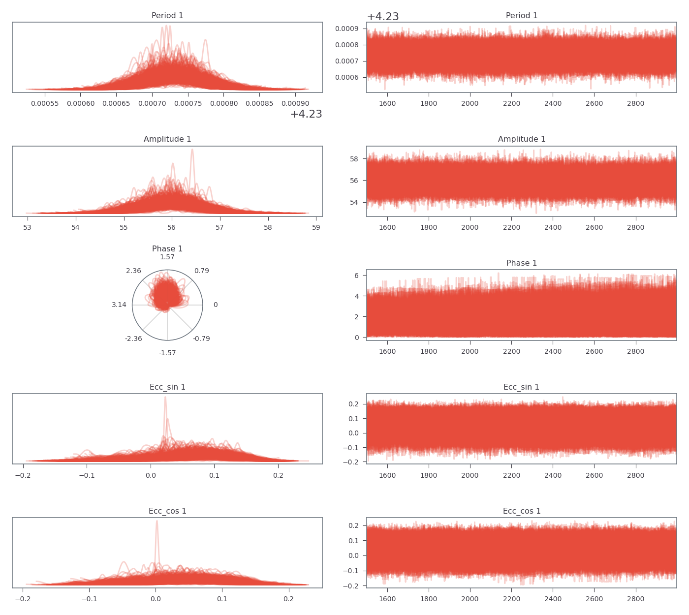

Normalised posterior for the Keplerian amplitude:
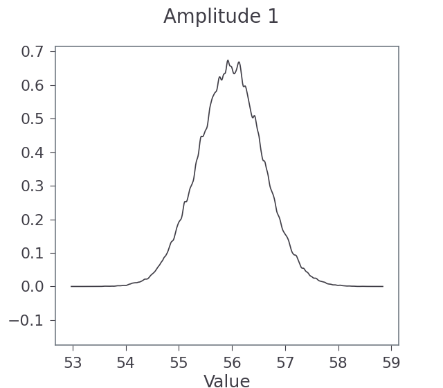

High Density Interval (HDI) for the Offset Block:
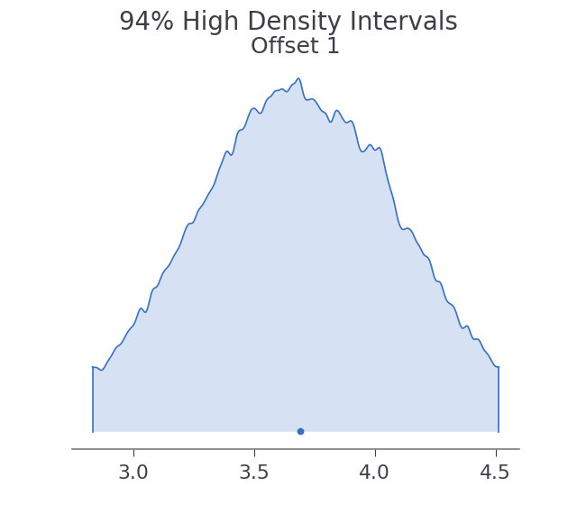

Each Block has its own corner plot, provided it has two or more dimensions. For example, the corner plot for the Keplerian Block:
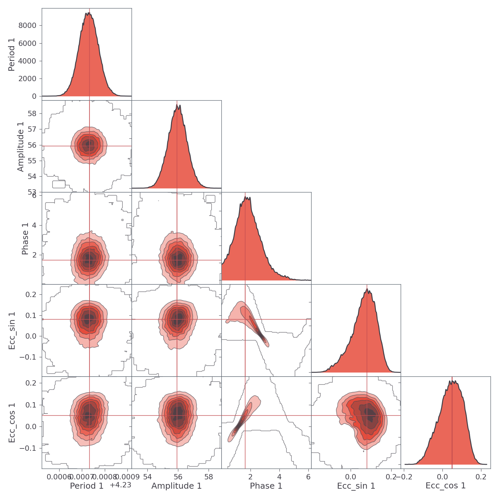

### Gaussian Mixtures

The Gaussian Mixtures are also plotted, for example, the amplitude parameter of the Keplerian Block:
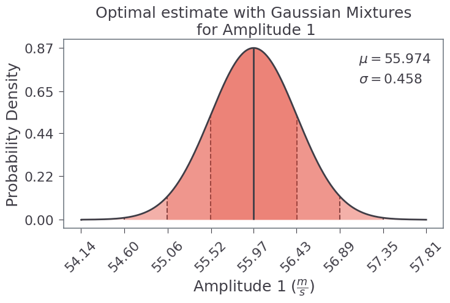